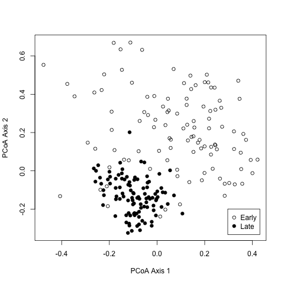

```{r knitr_settings, eval=TRUE, echo=FALSE, cache=FALSE}
opts_chunk$set("tidy" = TRUE)
opts_chunk$set("echo" = FALSE)
opts_chunk$set("eval" = TRUE)
opts_chunk$set("warning" = FALSE)
opts_chunk$set("cache" = FALSE)
inline_hook <- function(x){
    if(is.list(x)){
        x <- unlist(x)
    }
    if(is.numeric(x)){
        if(abs(x - round(x)) < .Machine$double.eps^0.5){
            paste(format(x,big.mark=',', digits=0, scientific=FALSE))
        } else {
            paste(format(x,big.mark=',', digits=1, nsmall=1, scientific=FALSE))
        }
    } else {
          paste(x)
    }
}
knitr::knit_hooks$set(inline=inline_hook)
```

```{r, scaling_up, echo = F}
shared_file_name <- "data/mothur/stability.trim.contigs.good.unique.good.filter.unique.precluster.pick.pick.pick.opti_mcc.shared"
shared_file <- read.table(file=shared_file_name, header=T, stringsAsFactors=F)
sequence_counts <- rowSums(shared_file[,-c(1,2,3)])
million_sequence_counts <- sum(sequence_counts)/1e6
average_sequence_counts <- mean(sequence_counts)
percentile_sequence_counts <- quantile(sequence_counts, prob=0.05)
```

**Scaling up.** The advantage of the dual-index approach is that a large
number of samples can be sequenced using a number of primers equal to only
twice the square root of the number of samples. To fully evaluate this
approach, we resequenced the V4 region of 360 samples that were previously
described by sequencing the distal end of the V35 region on the 454 GS-FLX
Titanium platform [@Schloss2012]. In that study, we observed a clear separation
between murine fecal samples obtained from 8 C57BL/6 mice at 0 to 9 (early)
and 141 to 150 (late) days after weaning, and there was significantly less
variation between the late samples than the early samples. In addition to
the mouse fecal samples, we allocated 2 pairs of indices to resequence our
mock community. We generated `r format(round(million_sequence_counts, 1), nsmall=1L)`
million pairs of sequence reads from the 16S rRNA gene with an average coverage of
`r format(round(average_sequence_counts, 1), nsmall=1L)` pairs of reads per sample
(95% of the samples had more than
`r format(round(percentile_sequence_counts, 1), nsmall=1L)` pairs of sequences) using a new
collection of 8-nt indices (see the supplemental material). Although
individual samples were expected to have various amplification efficiencies,
analysis of the number of reads per index did not suggest a systematic
positive or negative amplification bias that could be attributed to the
indices. The combined error rate for the two mock communities was 0.07%
before preclustering and 0.01% after (n = 14,094 sequences). When we used
UCHIME to remove chimeras and rarefied to 5,000 sequences, there was a
average of 30.4 OTUs (i.e., 10.4 spurious OTUs). Similar to our previous
results, ordination of the mouse fecal samples again showed the separation
between the early and late periods and increased stabilization with age
(Fig. 4) (Mantel test coefficient, 0.81; P < 0.001). These results clearly
indicate that our approach can be scaled to multiplex large numbers of
samples.



**FIG 4** Principal coordinate ordination of YC values (28) relating the
community structures of the fecal microbiota from 12 mice collected on days
0 through 9 (Early) and days 141 through 150 (Late) after weaning.

```{r, result="asis"}
days <- as.numeric(gsub(".*D(\\d*)_.*", "\\1", shared_file$Group))
n_samples_per_day <- numeric()
mean_seqs_per_day_per_sample <- numeric()
total_seqs_per_day <- numeric()
unique_days <- sort(unique(days))
for(d in unique_days){
    n_samples_per_day[as.character(d)] <- nrow(shared_file[days == d, -c(1,2,3)])
    total_seqs_per_day[as.character(d)] <- sum(shared_file[days == d, -c(1,2,3)])
    mean_seqs_per_day_per_sample[as.character(d)] <-
                            mean(apply(shared_file[days == d, -c(1,2,3)], 1, sum), na.rm=T)
}
data <- data.frame(unique_days, mean_seqs_per_day_per_sample,
                                        total_seqs_per_day, n_samples_per_day)
kable(data, digits=c(0, 1, 0, 0), row.names=FALSE,
                         col.names=c("Day", "Seqs. per<br>sample (mean)",
                         "Seqs. per<br>day (total)", "Number of<br>samples"), align='c')
```

```{r summary, echo = F, include = T}
summary(sequence_counts)
```

```{r histogram, echo = F, include = T, fig.cap = "Histogram of sequence counts", fig.width = 3, fig.height = 3, fig.align = "center", dev = "png"}
hist(sequence_counts)
```

##References
